# ◆ OPEN-TERMINAL

A free, open-source financial and OSINT intelligence terminal in Python. Mirrors
the core Bloomberg workflows — equities, macro, maritime, aviation, news — using
only free APIs, public data and open standards.

No paid subscriptions. No API keys required to start.

```bash
pip install -r requirements.txt
python -m nltk.downloader -d .venv/share/nltk_data vader_lexicon
streamlit run app.py
```

The second line installs the sentiment lexicon. Skip it and everything still
runs — headlines just score `+0.00` across the board. See
[Headline sentiment](#headline-sentiment).

---

## What it does

| Module | Command | Capability |
|---|---|---|
| **Home** | `HOME` | Market overview: index, commodity and crypto tiles, macro-regime banner, Treasury curve, top headlines, chokepoint status, and a daily sector heatmap you can **click into** to browse and filter the companies in that sector |
| **Equity** | `AAPL EQUITY` | Candlesticks + EMA/RSI/MACD/Bollinger/ATR, as-reported financials from SEC XBRL, the SEC filings index, comparables from the issuer's own industry classification, options chains, per-ticker news, named executives with disclosed pay, and official social handles from Wikidata |
| **Fundamentals** | `AAPL FA` | Explainable BUY/HOLD/SELL verdict: business quality, financial health, earnings quality and multi-method intrinsic value, adapted per industry profile |
| **Supply Chain** | `AAPL SPLC` | Named customers from the 10-K (anonymised ones reported as anonymised, never guessed), reported revenue by region, commodity dependency as return correlations, and Altman Z-score credit risk — every edge traced to a filing |
| **Macro** | `YCRV` `REGIME` `CPI ECO` | Growth/inflation regime matrix, full 11-tenor Treasury curve, inversion detection, composite recession score, inflation and labour dashboards, Fed net liquidity, FRED series browser, World Bank cross-country data |
| **Maritime** | `SUEZ SHIP` | AIS vessel positions, 7 chokepoint congestion monitors scored against locally measured baselines, MMSI/IMO lookup, custom area scans |
| **Aviation** | `EUROPE FLY` | Live ADS-B state vectors drawn as light-blue dots, fleet tracking by ICAO operator designator, aircraft tracks, airport throughput |
| **Portfolio** | `PF` `ALLOC` `BRIEF` | Holdings and watchlist editor, mark-to-market in one base currency (SGX, London and other non-USD listings converted at live FX), position concentration, GICS sector exposure with ETF look-through, rebalancing against a live benchmark, and an 08:00 SGT morning brief with a written summary of the book |
| **News** | `NEWS` `AAPL SOCIAL` | 21 RSS feeds + GDELT, sentiment scoring, trending-term extraction, and multi-platform sentiment fusion across headlines, StockTwits and Reddit |

Command bar accepts Bloomberg-style syntax: `<SUBJECT> <FUNCTION>`. Type `HELP`
for the full reference. Every module is pictured under
[Screenshots](#screenshots).

---

## Screenshots

Captured at 1920×1080 from a fresh install — no API keys set, and a made-up
demo portfolio in place of real holdings. Click any image for full size.

<table>
  <tr>
    <td width="50%" valign="top">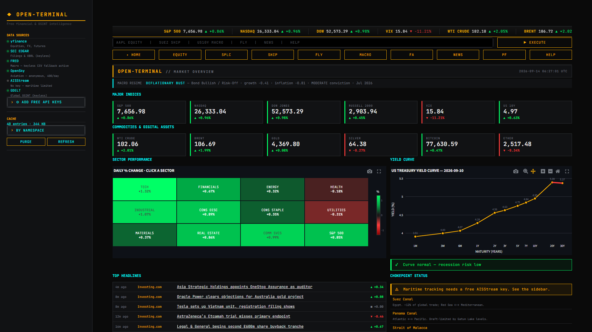<br><b>Home</b> — index, commodity and crypto tiles, the macro regime banner, the Treasury curve, top headlines and chokepoint status.</td>
    <td width="50%" valign="top">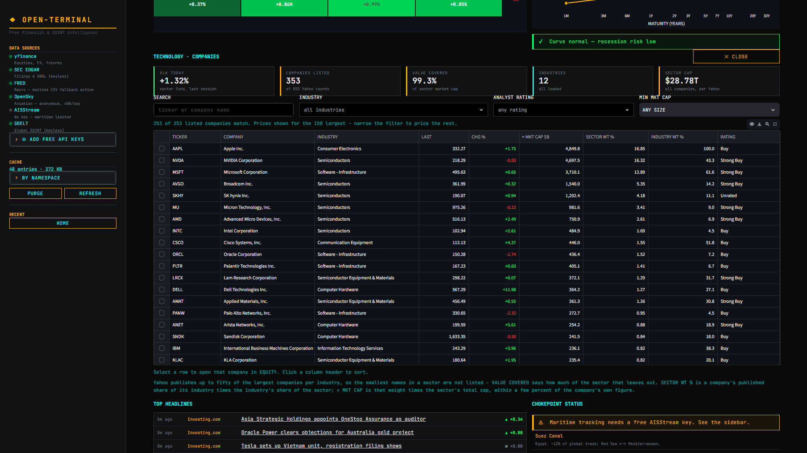<br><b>Sector drill-down</b> — click a tile on the daily heatmap to browse that sector's companies, with search, industry, rating and size filters, live prices and a row that opens straight into EQUITY.</td>
  </tr>
  <tr>
    <td valign="top">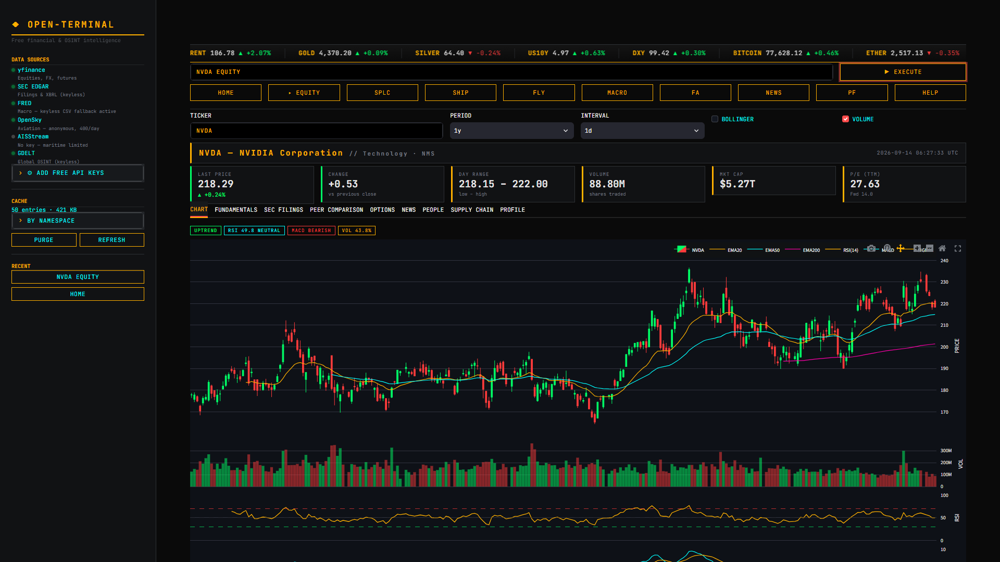<br><b>Equity</b> — candlesticks with EMAs, volume, RSI and MACD, plus tabs for fundamentals, SEC filings, peers, options, news, people, supply chain and profile.</td>
    <td valign="top">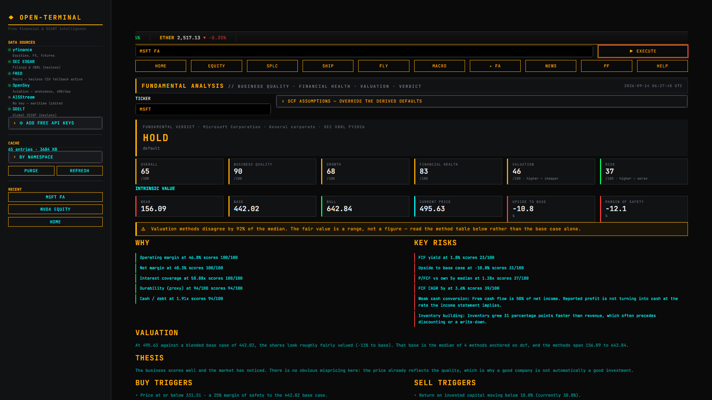<br><b>Fundamental verdict</b> — a mechanical BUY/HOLD/SELL with per-axis scores, a bear/base/bull value range, the reasons and risks behind it, and a warning when valuation methods disagree.</td>
  </tr>
  <tr>
    <td valign="top">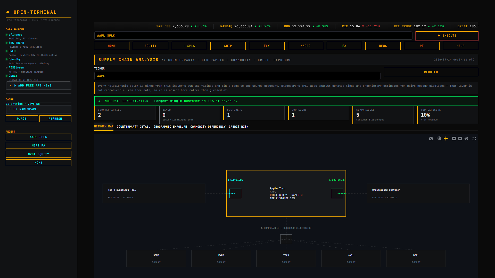<br><b>Supply chain</b> — counterparties mined from the issuer's own filings; a customer the 10-K does not name is shown as undisclosed rather than guessed.</td>
    <td valign="top">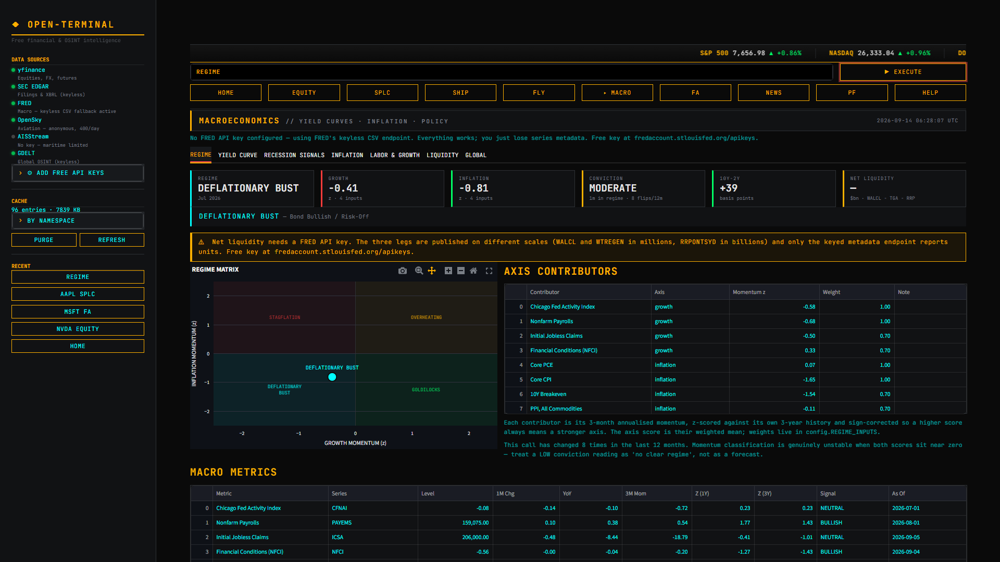<br><b>Macro regime</b> — the growth/inflation quadrant with every contributing series, its momentum z-score and weight. Net liquidity stays blank without a FRED key.</td>
  </tr>
  <tr>
    <td valign="top">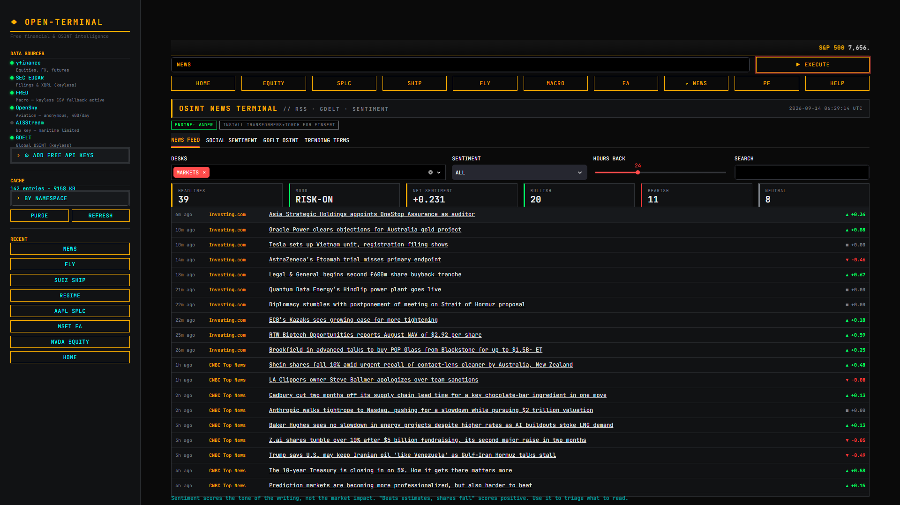<br><b>News</b> — headlines from the RSS desks scored for sentiment, with mood and bullish/bearish counts.</td>
    <td valign="top">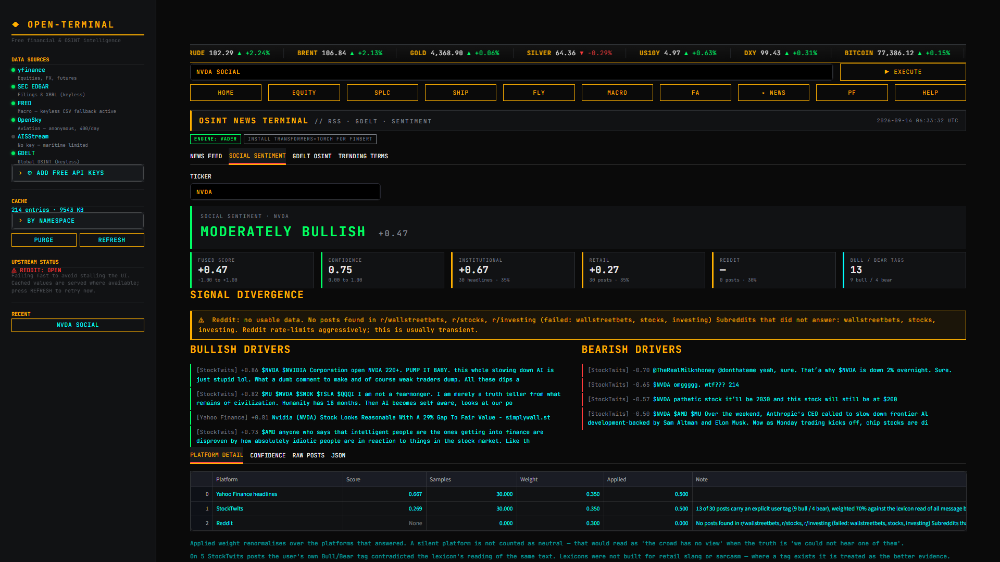<br><b>Social sentiment</b> — headlines, StockTwits and Reddit fused into one score. Reddit was rate-limiting when this was taken, so its weight renormalised over the two platforms that answered instead of counting as neutral.</td>
  </tr>
  <tr>
    <td valign="top">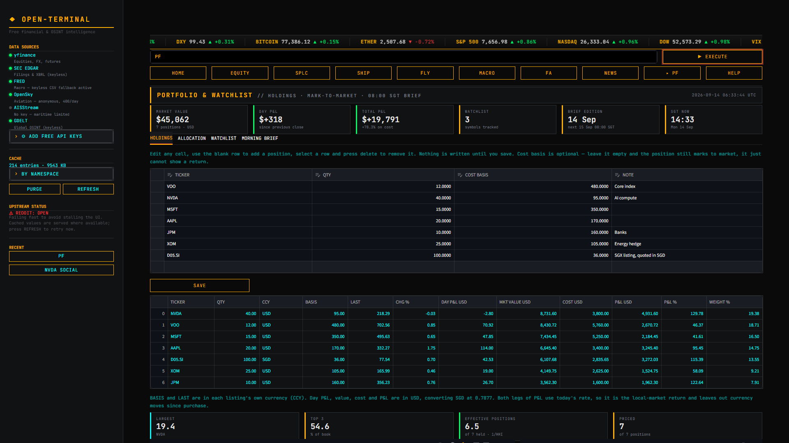<br><b>Portfolio</b> — holdings marked to market in one base currency. D05.SI is quoted in SGD and converted at the live rate named under the table.</td>
    <td valign="top">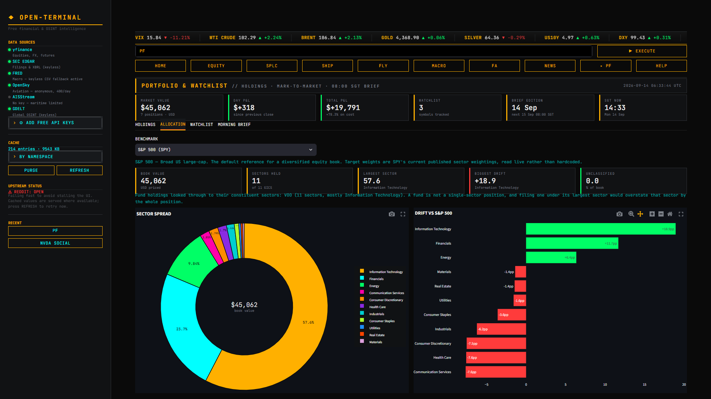<br><b>Allocation</b> — GICS sector exposure with ETF look-through, drift against a live benchmark and the rebalancing actions it implies.</td>
  </tr>
  <tr>
    <td valign="top">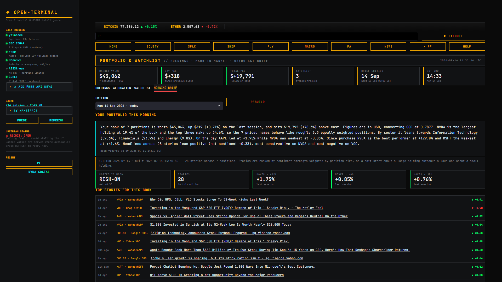<br><b>Morning brief</b> — the 08:00 SGT edition: a written summary of the whole book, then stories ranked by sentiment strength times position weight.</td>
    <td valign="top">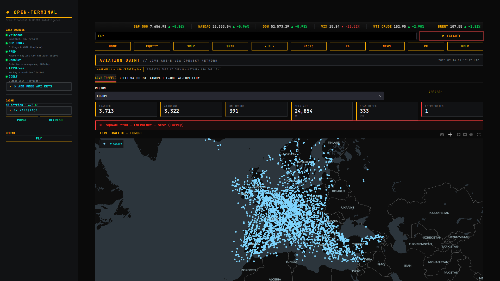<br><b>Aviation</b> — live ADS-B traffic from OpenSky's anonymous tier, one light-blue dot per aircraft, with fleet, track and airport-flow tabs.</td>
  </tr>
  <tr>
    <td valign="top">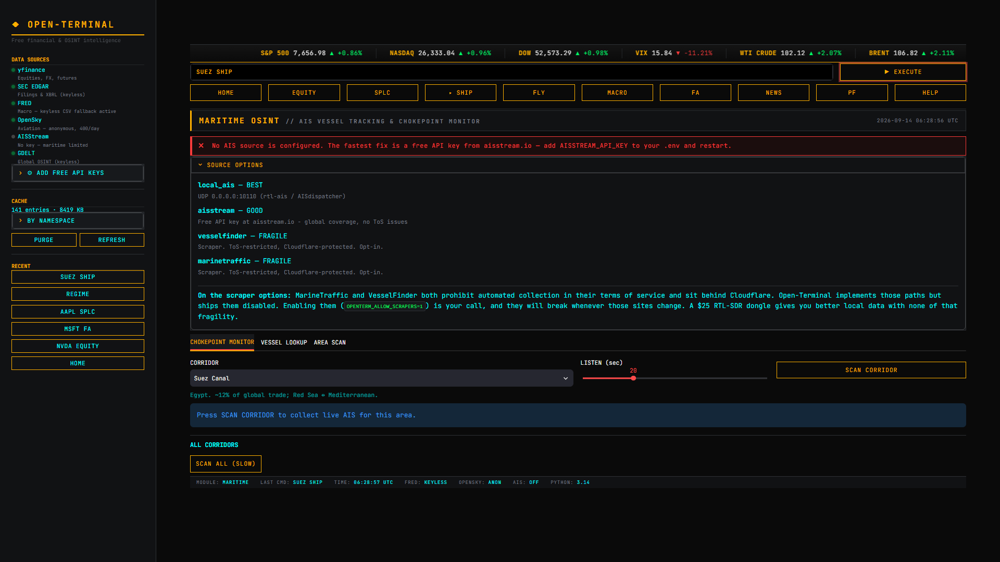<br><b>Maritime</b> — shown without an AISStream key: the module says so and lists the source options instead of drawing an empty map.</td>
    <td></td>
  </tr>
</table>

---

## Data sources

Everything here is free. The credentials are all optional.

| Source | Key needed? | Notes |
|---|---|---|
| yfinance | No | Prices, fundamentals, options. Unofficial; 15-min delayed |
| SEC EDGAR | No | Filings + XBRL company facts. Requires a descriptive User-Agent |
| FRED | Optional | Keyless CSV endpoint is used automatically when no key is set. Net liquidity is the one feature that needs a key — see below |
| OpenSky | Optional | 400 credits/day anonymous, 4000 with free OAuth2 credentials |
| AISStream | **Yes** (free) | The only module that genuinely needs a key to function |
| GDELT | No | Global news index, 65+ languages |
| StockTwits | No | Retail posts with explicit user Bull/Bear tags. Cloudflare-fronted |
| Reddit | No | RSS only — the JSON API is 403 without OAuth. Rate-limits hard |
| World Bank | No | Cross-country macro |

Copy `.env.example` to `.env` and fill in whichever you want:

```
FRED_API_KEY=...          # fredaccount.stlouisfed.org/apikeys
OPENSKY_CLIENT_ID=...     # opensky-network.org -> Account -> API Client
OPENSKY_CLIENT_SECRET=...
AISSTREAM_API_KEY=...     # aisstream.io
SEC_USER_AGENT=Open-Terminal/1.0 (research; you@example.com)
```

---

## Architecture

```
app.py                  Streamlit entry point, command parser, routing
config.py               Credentials, TTLs, chokepoints, feeds, designators
data_fetchers/
  equities.py           yfinance + SEC EDGAR XBRL + indicators
  macro.py              FRED (3-tier fallback) + World Bank + curve analysis
  macro_regime.py       Growth/inflation panel, z-scores, regime matrix
  fundamentals.py       Facts -> metrics -> axis scores -> verdict
  valuation.py          DCF, multiples, peer/own history, bear/base/bull
  maritime.py           AIS: local SDR -> aisstream -> scrapers
  aviation.py           OpenSky OAuth2 + state vectors
  news.py               RSS + GDELT + VADER/FinBERT sentiment
  social.py             StockTwits + Reddit -> fused sentiment score
  supply_chain.py       10-K counterparties, SEC report tables, Altman Z
  company_intel.py      Named executives + Wikidata social handles
  portfolio.py          Holdings, FX-converted mark-to-market, morning brief
  allocation.py         GICS exposure, ETF look-through, rebalancing
  sectors.py            Sector constituents behind the home heatmap drill-down
ui/
  terminal_theme.py     Bloomberg palette, CSS, Plotly template
  components.py         Tape, tiles, charts, donuts, news feed, tables
  maps.py               Folium + Plotly dark geo rendering
utils/
  cache.py              SQLite TTL cache + requests-cache sessions
  rate_limiter.py       Backoff, token buckets, circuit breakers
  observations.py       Append-only local series -> measured baselines
  macro_analytics.py    Pure stats: alignment, z-scores, momentum
  fundamental_math.py   Pure: CAGR, score anchors, DCF, margin of safety
```

### Nothing is asserted that can't be sourced

Every number on screen traces to a fetch, a filing or this installation's own
measurements. That is a constraint the code is written around, not a slogan,
and three places used to break it:

- **Chokepoint congestion** was scored against a hand-written "normal vessel
  count" per corridor. The gauge read SEVERE or LIGHT off a denominator
  somebody had guessed. Baselines are now the median of the counts this
  terminal has itself recorded for that corridor *on that source* — a local
  SDR and a global websocket see different fractions of the same traffic, so
  they never share a baseline. Below 12 readings the status is `MEASURING
  (n/12)` and no ratio is shown.
- **Equity comparables** fell back to a megacap-tech list for any ticker that
  matched none of seven hardcoded sector groups, so a regional bank was
  benchmarked against NVDA. Peers now come from the issuer's own Yahoo
  industry classification, ranked by market weight — or from its sector where
  the company *is* its industry (Apple is 99.9% of "consumer electronics", so
  that list is five microcaps). When neither classification resolves, the
  table says so and asks you for a peer set.
- **Aviation watchlists** were specific ICAO24 hex addresses labelled by hand
  ("FedEx B777F"), unverified against any registry and stale the moment an
  airframe changed hands. Fleets are now ICAO Doc 8585 operator designators
  matched against the callsigns aircraft are broadcasting live, so a row
  exists only for something OpenSky can currently see.

The pattern in each case: where a free authoritative source exists, use it;
where one doesn't, measure it locally and show the sample count; where neither
is possible, render nothing and say why. An empty panel is a finding.

### The macro regime matrix

`REGIME` reads the growth/inflation quadrant off the acceleration in both
axes, not their levels. Each contributing series is turned into its 3-month
annualised momentum, that momentum is z-scored against its own 3-year history,
inverted where a rising reading means a weakening axis (jobless claims,
financial conditions), and the axis score is the weighted mean. Weights and
contributors live in `config.REGIME_INPUTS`; every one of them is shown
alongside the verdict so the call can be argued with.

Three things about it are worth knowing before you trust a reading:

- **The historical strip is not a backtest.** FRED stamps an observation at
  the start of the period it describes, but a July CPI print is not public
  until mid-August and is revised for months after. The shaded bands are
  today's revised data placed at the date it describes, so they will always
  look more prescient than any real-time reading was.
- **The call is unstable near the axes.** Over the last decade it flips
  roughly every two months, because a quadrant read off two scores near zero
  will change on noise. That is reported rather than smoothed away — the card
  shows conviction and a flip count, and a LOW conviction reading means "no
  clear regime", not a forecast. A persistence rule would produce a steadier
  label and a less honest one.
- **Every series declares its own units.** Unemployment moving 4.0 → 4.2 is
  +0.2 percentage points; CPI moving 100 → 105 is +5 percent. Both format
  identically in a table, and quoting the first as +5% describes a labour
  market collapse that did not happen. `utils/macro_analytics` takes a
  `transform` per series for exactly this reason, and the suite tests that
  the two disagree.

### Fed net liquidity needs a FRED key

`WALCL − WTREGEN − RRPONTSYD` is the one calculation here that will not run
keylessly, because FRED does not publish the three legs on one scale:

| Series | Units | Recent |
|---|---|---|
| `WALCL` | **Millions** of USD | 6,676,249 |
| `WTREGEN` | **Millions** of USD | 800,502 |
| `RRPONTSYD` | **Billions** of USD | 11.7 |

Subtract them raw and the repo facility comes off a thousand times too small.
That is immaterial today with the facility nearly empty, and a $2.2 trillion
overstatement at its 2022–23 peak — with a chart that looks entirely
reasonable in both cases. Units live in FRED's metadata endpoint, which needs
an API key; the keyless CSV path returns bare observations.

Inferring the scale from magnitude was implemented and then removed:
`RRPONTSYD` currently prints ~12, which any magnitude heuristic reads as
trillions and scales up by 1000×. With no key the panel says so and shows
nothing rather than publishing a number it cannot stand behind.

### The fundamental verdict

`FA` answers one question: given the filings and the current price, is this a
BUY, HOLD or SELL? It is a mechanical screen, explainable end to end, and it
is **not investment advice**.

**Why it is a gate, not a score.** A low P/E must not by itself produce BUY and
a high P/E must not by itself produce SELL — and one summed number cannot
express "cheap but deteriorating", which is the case that costs money. So the
verdict tests three axes in order (`config.VERDICT_RULES`): quality first, then
value, then risk. A business scoring 40 for quality at a bargain price lands in
SELL. One scoring 90 at a rich price lands in HOLD.

**Why every score is explainable.** There is no fitted curve and no tuned
constant. Each component is a raw value, a named anchor table and a linear
interpolation — `score_band(0.19, [(0,0), (0.15,70), (0.25,90)])` is 78, and
the breakdown table prints all three so the headline can be recomputed by hand.
A metric that will not compute is skipped and the axis renormalises over what
resolved; it is never scored zero, which would read as poor performance rather
than absent data.

**What it refuses to tell you.** Competitive moat, market share, management
quality and industry outlook have no free data source. Moat and capital
allocation are scored as *labelled proxies* from things that are filed — ROIC
persistence, gross-margin stability, share count, buybacks, debt direction.
Market share and industry outlook are reported as NOT AVAILABLE, excluded from
every score, and they dock the confidence figure on every single run. A
fabricated "wide moat" reads identically to a real one on screen.

**Per-industry anchoring**, because running one DCF over everything is a
category error, not conservatism:

| Profile | Anchor | Not available at any price |
|---|---|---|
| General | Two-stage DCF on normalised FCF | — |
| Bank / insurer | Justified P/B from ROE — a lender's FCF is a funding artefact | CET1, true NIM, NPL ratio |
| REIT | P/AFFO, scored on FFO margin; GAAP depreciation makes net income uninformative | NAV, occupancy, same-store NOI |
| Commodity | Mid-cycle margins — trailing earnings say where in the cycle the window fell | Per-unit production cost, reserve life |
| High-growth tech | EV/sales and P/FCF; trailing P/E is negative or meaningless | Net revenue retention, RPO |

**Confidence is itemised.** "62" is useless; "62, because the statements came
from Yahoo rather than EDGAR and the valuation methods disagree by 90%" is
actionable. Below `config.CONFIDENCE_FLOOR` the report shows INSUFFICIENT DATA
instead of a verdict.

### Two XBRL bugs this feature surfaced

Both were pre-existing, both produced confident output, and both are now
regression-tested:

- **Fact unit selection.** `_facts_for_tag` chose the unit as `"USD" if "USD"
  in units else next(iter(units))` — first key in dict order. Coca-Cola tags
  `EarningsPerShareDiluted` under both `pure` (four stray 10-Q facts) and
  `USD/shares` (fifty-one 10-K facts), so the fallback took `pure`, found no
  annual facts, and returned nothing. KO's diluted EPS came back empty from a
  filing that reports it on every page, and both P/E-based valuations silently
  dropped out. The unit is now chosen by which one actually carries facts for
  the requested form.
- **A one-off year as the DCF base.** KO's FY2025 free cash flow was $5.3bn
  against $9–11bn either side, entirely from one contingent-consideration
  payment. Compounded for ten years that produced a fair value roughly half
  what the business supports. The DCF now runs off the median FCF *margin*
  applied to current revenue, which strips the one-off without dragging a
  fast-growing company back to what it earned three years ago.

### Multi-platform sentiment fusion

`AAPL SOCIAL` fuses three crowds into one score on -1.00 to +1.00:
Yahoo headlines (35%), StockTwits (35%) and Reddit (30%).

**The disagreement is the point.** A fused number on its own buries the only
genuinely interesting reading — when headlines are positive and the crowd is
selling, or the reverse. That case is detected explicitly, reported in
`signal_divergence`, and it pulls confidence down rather than being averaged
into a comfortable middle. Opposite directions are flagged even when the gap
is small, provided both readings clear a noise floor.

**A silent platform is not a neutral one.** Weights renormalise over the
platforms that actually answered. Zero-filling a dead StockTwits leg would
drag a +0.60 reading to +0.39 and flip the band from EXTREMELY to MODERATELY
BULLISH — a change caused by an outage, presented as a change in sentiment.
When nothing resolves, the band is `NO SIGNAL`, not `NEUTRAL`.

**Where users tag their own posts, believe them.** VADER scores
*"$NVDA sell it bro. Best salesman of the century"* at **+0.79 bullish** —
lexicons were not built for retail slang or sarcasm. About half of StockTwits
posts carry a self-declared Bull/Bear tag, which is a statement of the
author's actual position rather than a guess at their wording. Tags carry 70%
of the retail score and set the direction of any post that has one. The panel
also reports how often the two disagreed, which is the honest measure of how
much the lexicon can be trusted on that stream.

**Drivers are filtered to items naming the ticker.** Yahoo's per-ticker feed
carries sector pieces about other companies and StockTwits users cash-tag
five symbols per post. Unfiltered, the top "bullish NVDA driver" was a
headline about Progress Software — worse than no driver, because it looks
like evidence. Below four matches the unfiltered set is shown with a caption
saying so.

**Confidence is coverage x volume x agreement**, each itemised. A large but
contradictory sample does not read as confident.

#### Endpoint notes

Two things worth knowing before changing the fetchers:

- **StockTwits rejects `PLAIN_USER_AGENT`.** It sits behind Cloudflare and
  serves a challenge page to the plain client string; it needs a descriptive
  or browser UA. This is the exact opposite of FRED's `fredgraph.csv`, which
  accepts the connection and then never replies when sent a browser UA. Both
  requirements are load-bearing and they contradict each other — do not
  "harmonise" them.
- **Reddit's JSON API is gone without OAuth** (403 on everything). The `.rss`
  endpoints still answer with a browser UA but rate-limit hard: three quick
  probes during development earned a 429. It gets the slowest token bucket in
  the codebase, one retry instead of five, and a circuit breaker that opens
  after two failures — firing fifteen requests at an endpoint that just said
  "too many requests" makes the problem worse, not better.

### Sector allocation and rebalancing

`ALLOC` maps holdings to the eleven GICS sectors, compares them to a
benchmark, and converts the gap to dollars. Two things it will not guess:

**A fund is not a sector.** VOO is not "a technology position" and it is not
unclassifiable either — it is 37% technology, 12% financials and nine other
things. Fund holdings are looked through to their published sector weights
and distributed accordingly. This is not a marginal correction: the test
portfolio is 55% VOO, so filing it under its largest sector would have shown
technology at 55%+ when the truth is nearer 30%, and dropping it showed the
book as 55% unknown.

**Benchmark targets are read, never typed.** Each benchmark names a real fund
— S&P 500 via SPY, Tech Growth via QQQ, Income/Defensive via SCHD, Value via
VTV — and its *current* published sector weights define the target. Index
weights move constantly (technology has gone from about a quarter of the S&P
500 to over a third in a few years), so a hardcoded table is wrong the day
after it is written and keeps rendering a confident drift column while it
rots.

Anything that cannot be placed is reported as UNCLASSIFIED with its dollar
value and **excluded from the drift arithmetic**. Leaving it in the
denominator understates every sector by the same amount, so the whole book
reads underweight and eleven spurious ADD actions appear. Drift below 2pp
produces no action at all — it costs more in spread and tax to fix than it
represents, and a list of eleven trivial actions buries the two that matter.

#### The position weight panel

Reworked from a bare bar chart at a fixed 280px. Three usability problems,
none of them correctness:

- **Fixed height.** Six positions got fat bars and dead space; twenty got
  unreadable slivers. Height now scales with the row count, floored and
  capped.
- **Percent only.** "VOO 54.9%" is the less useful half of the answer when
  you want to know what that is in money. Bars now carry both.
- **No concentration read.** A weight list does not tell you that six
  positions behave like fewer than three. The effective position count
  (1/HHI) does — a twenty-name book where one holding is 60% has an effective
  count near three, and that is the number that describes the risk.

It also says out loud when unpriced positions are missing from the picture.
They were being dropped silently, so a book with a dead symbol showed weights
summing to 100% of something smaller than the book.

Bars sit beside a donut on both the holdings and allocation views, because
they answer different questions: bars rank and compare precisely, a donut
shows share of the whole and puts the total in the hole — the one number a
pie otherwise throws away. Slice order is pinned to the table order
(Plotly re-sorts pies by default, which quietly breaks that
correspondence), and past twelve slices the smallest are pooled into OTHER
with its real total kept.

The shared Plotly colorway went from eight entries to twelve for this.
There are eleven GICS sectors, and Plotly cycles the list — so eight
colours put two slices in the same shade, which reads as one category
split in two.

### Multi-currency portfolios

Yahoo quotes each listing in its exchange's currency — D05.SI in SGD, VOO in
USD, a London line in pence — and cost basis is entered in that same listing
currency, because that is what the broker statement shows. Adding those
figures straight together produces a total in no currency at all, which is
exactly what the portfolio page used to do behind a "$". Every position is now
converted into one base currency (`OPENTERM_BASE_CURRENCY`, default `USD`) at
the live `{CCY}{BASE}=X` rate before anything is summed:

- **The native price stays visible.** LAST and BASIS still match the
  statement; day P&L, market value, cost and P&L are in the base currency, and
  the caption under the table names the rate that was applied.
- **A missing rate is not a rate of 1.0.** If the FX cross or a listing's
  quote currency cannot be fetched, the position is left unpriced and says
  why (`no SGD to USD rate`) rather than being added in at a guessed rate —
  which would quietly recreate the original bug on the one day the cross
  failed to load.
- **Quote currency, not reporting currency.** PDD reports in CNY and trades in
  USD. The price is what gets multiplied by a quantity, so the price's
  currency is the one used.
- **Minor units.** London quotes in GBp, so a price of 250 there is 2.50
  pounds before the GBP cross is applied.
- **Exchange suffixes survive.** `VOD.L`, `SAP.F`, `7203.T` and `FUU.V` stay as
  typed; only US share classes are rewritten to Yahoo's dash form
  (`BRK.B` → `BRK-B`). A lone `.V` is read as TSX Venture, so McCormick's
  voting stock has to be entered as `MKC-V`.

P&L converts both legs at today's rate, so it is the local-market return
expressed in the base currency. The currency move since purchase is not in
it: the rate on the purchase date was never recorded.

### Sector drill-down

Click any tile on the home heatmap and that sector's companies open underneath
it: search by ticker or name, filter by industry, analyst rating and minimum
market cap, sort by any column, and select a row to open the company in
`EQUITY`.

- **Weights are read, not typed.** Constituents come from Yahoo's sector and
  industry tables. A company's share of the sector is its published share of
  its industry times the industry's published share of the sector.
- **A partial list is labelled as one.** Yahoo publishes up to fifty of the
  largest companies per industry. Technology lists 353 of the 853 companies
  Yahoo counts — but those 353 cover 99.3% of the sector's market cap. The
  panel always shows listed-versus-counted and value covered, and names any
  industry that failed to load instead of silently shrinking the list.
- **Market cap is marked approximate.** `≈ MKT CAP` is the sector weight times
  the sector's total cap, which lands within a few percent of a company's own
  figure (NVDA: $5,067B derived against $5,271B reported).
- **Prices are fetched for the 150 largest matches**
  (`config.SECTOR_PRICE_LIMIT`). A whole industrials list runs to several
  hundred names — too slow to reprice on every filter change — so narrowing
  the filter prices the rest.

Plotly cannot select heatmap cells and Streamlit only reports selectable
points, so each tile carries an invisible marker at its centre that owns the
hover and the click. Every cell gets one, including the S&P 500 tile, which
is the whole market rather than a sector and deliberately opens nothing.

### The morning brief

`BRIEF` is an *edition*, not a background job. Asking a Streamlit app to run
something at 08:00 assumes a process is alive at 08:00, which for a local
terminal is exactly when it is not. Each edition is stamped with the SGT
trading day it belongs to: before 08:00 SGT you are reading yesterday's, and
the first page load at or after 08:00 builds today's and saves it. Open the
terminal at 07:00, 08:00 or noon and you read the same document.

Stories are ranked by sentiment strength times position weight, so a mildly
negative story about a third of the book outranks a loud headline about a 2%
position. The edition opens with a written paragraph on the whole book —
value, day move, P&L against cost, concentration, sector lean, the day's
movers and headline tone. Every clause is conditional on the figure behind it
existing: a book with no cost basis entered does not get a sentence saying it
is "0.0% above cost", because that reads exactly like a real result. The
figures are stored with the edition, so an archived brief describes the book
as it was that morning.

### Resilience

Free data sources fail constantly. Three layers handle it:

- **Caching** — SQLite TTL cache (daily bars 1h, scrapes 15m, fundamentals 24h).
  If an upstream dies and a stale entry exists, the stale value is served with
  its age rather than an error.
- **Backoff** — every request retries with exponential backoff and jitter,
  honouring `Retry-After`. Per-provider token buckets keep request rates well
  inside published limits.
- **Circuit breakers** — after 3 consecutive failures a provider is marked down
  and calls fail instantly instead of paying the retry budget. Without this, a
  FRED outage made the yield curve (11 tenors × 5 attempts × 20s) take eleven
  minutes to render nothing. Tripped breakers surface in the sidebar.

---

## Tests

```bash
pytest                # 566 offline tests, ~5s
pytest -m network     # 11 live tests against SEC EDGAR and Yahoo
pytest -m "" -q       # everything
```

Network tests are excluded by default. Free upstreams go down constantly
(OpenSky 503s regularly), and a suite that goes red because of someone else's
outage trains you to ignore failures.

| File | Covers |
|---|---|
| `test_indicators.py` | RSI/ATR against a textbook Wilder loop, EMA/MACD/Bollinger identities, empty and short-frame edges |
| `test_xbrl.py` | SEC period labelling, duration/form filtering, restatements, live accounting identities |
| `test_resilience.py` | Circuit breaker states and fail-fast timing, retry/backoff, token bucket, cache TTL and stale-on-error, measured congestion baselines |
| `test_domain.py` | Command parser, ticker normalisation including exchange suffixes (`.L` `.F` `.T` `.V`) versus share classes, AIS sentinels and MMSI flags, yield-curve analysis, sentiment, derived peer selection, chart title serialisation |
| `test_fundamentals.py` | Score anchors and renormalisation, DCF guards, the two verdict constraints, XBRL unit selection, SEC/Yahoo row aliases, normalised FCF base, provenance |
| `test_social.py` | Sentiment bands, weight renormalisation over silent platforms, confidence from coverage/volume/agreement, divergence detection, tag-vs-lexicon direction, driver ticker filtering |
| `test_allocation.py` | GICS crosswalk both Yahoo spellings, ETF look-through vs single-sector filing, unclassified excluded from the drift denominator, action thresholds and OPEN-vs-ADD, effective position count |
| `test_macro_regime.py` | Frequency alignment and LOCF direction, z-scores, the percent-vs-percentage-point transform trap, ragged-edge truncation, quadrant mapping and sign conventions, FRED unit scaling |
| `test_portfolio_fx.py` | Base-currency conversion of SGX and London listings, native price kept, a missing FX rate or quote currency left unpriced (never treated as 1.0), pence units, configurable base currency, the FX and quote-currency fetchers, re-deriving brief summaries written before conversion |
| `test_portfolio_brief.py` | Book snapshot totals and day %, no cost basis means no P&L rather than zero, narrative clauses dropped when their inputs are missing, unpriced positions named, legacy editions backfilled without refetching headlines |
| `test_sectors.py` | Sector weight = industry share × member share, zero-weight members and failed industries, backfilled sector leaders, literal (non-regex) search, unrated and uncapped filters, heatmap tile → GICS mapping, clickable tiles and selection parsing |
| `test_maps.py` | Aircraft markers on the live traffic map: one light-blue colour whatever the altitude or speed, circle symbols (the only ones a map trace will colour), no colour scale, heading kept in the hover card, empty feeds |

The two indicator/XBRL files are **regression suites, not coverage padding**.
Both bugs they guard were invisible in the UI — the chart drew a plausible
oscillator, the statement table rendered real numbers under wrong headings.
Both were verified by mutation: reintroducing the original bug makes the
relevant suite fail.

If you change `rsi()`, `atr()` or `_extract_xbrl_series()`, run these first.

---

## Notes from building this

Things that were verified rather than assumed, and are easy to get wrong:

**SEC XBRL period labelling.** A fact's `fy`/`fp` fields identify *the report the
fact appeared in*, not the period the number describes. Apple's FY2023 revenue
appears in the FY2023, FY2024 and FY2025 10-Ks. Keying on `fy` and keeping the
newest filing shifts an entire income statement by two years — it reported
$383.285B as FY2025 revenue when the real figure is $416.161B. Periods are
therefore derived from each fact's own `end` date, with duration filtering to
separate annual from quarterly tags. Validated against the accounting
identities: gross profit ties, and the balance sheet balances.

**XBRL tag migration.** Filers switch tags mid-history, so candidate tags must
be *merged per period*, not tried until one hits. Microsoft reported cost of
revenue under `CostOfRevenue` through FY2017 and `CostOfGoodsAndServicesSold`
from FY2020; Apple used `PaymentsOfDividendsCommonStock` in FY2016-17 and
`PaymentsOfDividends` from FY2020. Returning on the first tag with any data
produced a decade-old series with every recent column blank — the line looked
simply unavailable. Merging gives MSFT a continuous 14-year cost line.

**Some blanks are correct.** Apple stopped disclosing goodwill separately after
FY2017 and interest expense after FY2023; no tag carries them. Microsoft
publishes no aggregate D&A tag at all — only `Depreciation` and
`AmortizationOfIntangibleAssets` separately. Those are deliberately *not*
substituted: a depreciation-only figure under a "Depreciation & Amortization"
heading is an understated number that looks authoritative, which is worse than
a blank.

**Tickers can outlive their registrant.** XOM currently resolves to
"ExxonMobil Holdings Corp" (CIK 2115436), a post-reorganisation entity that has
filed no 10-K and carries no `us-gaap` taxonomy — the financial history sits
under the predecessor CIK. Rather than render an empty table, this case is
detected and reported with the entity name and a pointer to the Yahoo source.

**RSI seeding.** Wilder's RSI starts from a *simple* mean of the first 14
changes, then smooths recursively. `ewm(adjust=False)` implements the recursion
correctly but seeds from the first single observation, which biases the series
for dozens of bars — on Wilder's own published example that gives 50.7 instead
of 70.5, enough to flip an overbought reading to neutral. `_wilder_average()`
plants the correct seed; output matches a textbook loop to ~1e-14. ATR had the
same bug.

**FRED and User-Agent.** `fredgraph.csv` accepts the TLS connection and then
never responds if you send a Chrome User-Agent, but answers in 0.3s with a plain
one. Conversely SEC and BLS return 403 to a browser UA and require a descriptive
contact string. User-Agent is selected per host.

**OpenSky auth.** Basic auth is deprecated; the API moved to OAuth2
client-credentials. Anonymous access still works at a quarter of the quota and
10-second resolution instead of 5.

**Map markers only take a colour as circles.** On a Plotly map trace, any
`marker.symbol` other than `"circle"` is drawn from the basemap style's Maki
icon sprite and ignores `marker.color` — Plotly's own docstring says so, in a
sentence that is easy to miss. The FLY map drew heading-rotated triangles
coloured by altitude, and on carto-darkmatter every one rendered black:
several thousand aircraft over Europe looked like an empty map. Aircraft are
now light-blue circles, with heading moved into the hover card.

**Free-data limits worth knowing.** Prices are delayed. AIS coverage is thin
outside major lanes. OpenSky's receiver network is sparse over oceans and much
of the global south — an absent aircraft is not evidence it isn't flying.
Headline sentiment measures the tone of the writing, not market impact
("beats estimates, shares fall" scores positive). None of this is investment
advice.

---

## On scraping

Open-Terminal prefers official free APIs over scraping wherever one exists —
SEC's XBRL API rather than parsing 10-K HTML, FRED's CSV endpoint rather than
the website, aisstream rather than MarineTraffic.

Playwright scrapers for MarineTraffic and VesselFinder are implemented but
**ship disabled**. Both sites prohibit automated collection in their Terms of
Service and both sit behind Cloudflare, so those paths are brittle by design and
will break without warning. Enabling them (`OPENTERM_ALLOW_SCRAPERS=1`) is a
decision you make deliberately.

For maritime data the genuinely better options are a free aisstream.io key, or a
~$25 RTL-SDR dongle running `rtl_ais` — your own antenna, no rate limits, no
terms of service, sub-second latency.

The aviation fleets ship institutional operators only: national carriers, cargo
fleets, government transports, identified by their published ICAO designators.
Aircraft positions are broadcast unencrypted and are legally receivable, but
sustained tracking of a *named private individual's* aircraft is treated very
differently in law across jurisdictions and is restricted by OpenSky's own
terms. Nothing stops you adding designators; think about that one first.

---

## Optional extras

```bash
playwright install chromium              # only if enabling scrapers
pip install transformers torch           # FinBERT instead of VADER (~3GB)
pip install openbb                       # auto-detected if present (~1GB)
```

## Headline sentiment

The NEWS module scores headlines with VADER, whose lexicon ships as data
rather than code. NLTK will fetch it on first use into `~/nltk_data`, so on
most machines nothing is needed. Two things make that worth pinning down:

**The failure is silent.** A missing lexicon does not raise — every headline
scores a flat `+0.00`, which looks like a market with no opinion rather than a
broken install. If the whole tape reads neutral, this is why.

**NLTK 3.10 validates data paths.** It ships a `pathsec` layer that refuses
any data file resolving outside an allowed root. Where the OS redirects the
home directory — sandboxed, containerised or packaged-app environments — the
lexicon lands in `~/nltk_data` but *resolves* somewhere else, and NLTK raises
`PermissionError`. The app catches it and reports the misleading "resource not
found, try re-downloading it" message; re-downloading writes to the same
redirected path and fails again.

Installing into a directory already on `nltk.data.path` sidesteps both:

```bash
python -m nltk.downloader -d .venv/share/nltk_data vader_lexicon
```

It lives inside the virtualenv, so a rebuilt venv needs it again. Verify with:

```bash
python -c "from nltk.sentiment.vader import SentimentIntensityAnalyzer as S; print(len(S().lexicon), 'entries')"
```

7502 entries means it loaded. A traceback means it did not.

Swapping VADER for FinBERT (see [Optional extras](#optional-extras)) removes
the dependency entirely — the model ships through `transformers`, not as
downloaded corpus data.

## Environment flags

| Flag | Effect |
|---|---|
| `OPENTERM_DEBUG=1` | Full tracebacks in the UI, debug logging |
| `OPENTERM_OFFLINE=1` | Render from cache only, zero network calls |
| `OPENTERM_ALLOW_SCRAPERS=1` | Enable the ToS-restricted scraper fallbacks |

## Requirements

Python 3.11+ (developed and tested on 3.14).

## License

MIT. Data belongs to its respective providers — check their terms before
redistributing anything you pull.
